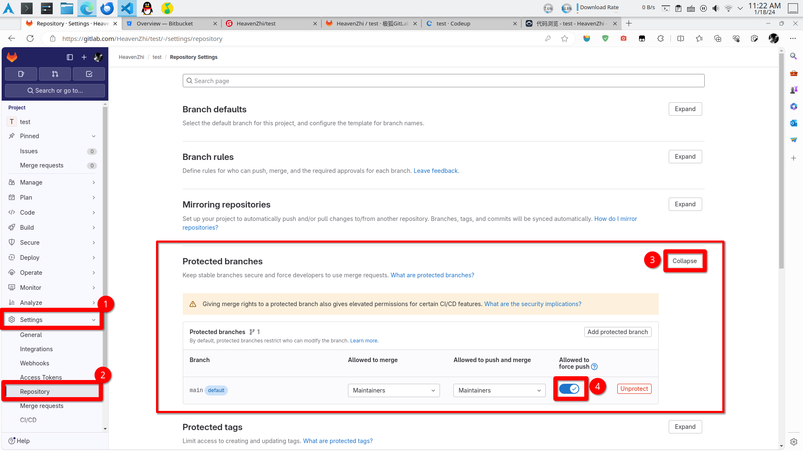
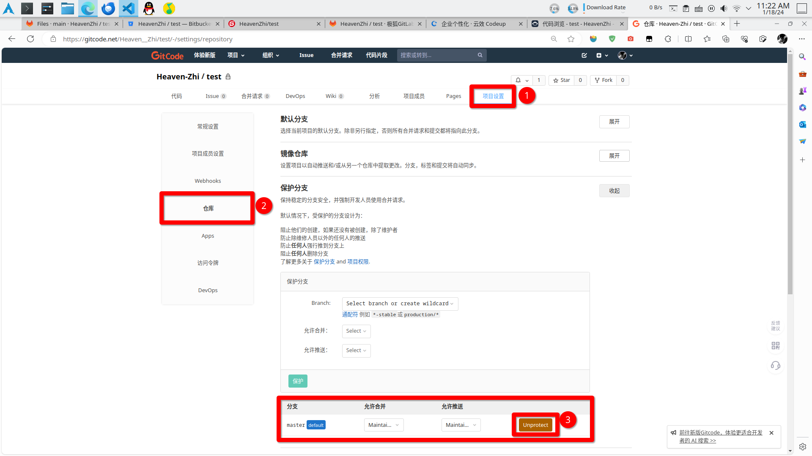

# Reusable Workflow

简体中文 | [English](./README.en.md)

**reusable-workflow** 是一组可重用的 **GitHub Workflow**。你可以引用这个项目的 **GitHub Workflow**，并在自己的项目中使用它，而无需重新编辑。

## Push Mirror Git Repository

这是一个用于完全镜像单个 **Git Repository**，并将这个镜像批量推送到其他 **Git Repository** 平台的 **GitHub Workflow**。

经过实际测试该 **GitHub Workflow** 可向下列代码托管平台的 **Git Repository** 推送镜像：

- `gitlab.com`
- `bitbucket.org`
- `gitee.com`
- `jihulab.com`
- `codeup.aliyun.com`
- `coding.net`
- `gitcode.net`
- `gitlink.org.cn`

### 如何使用

使用方法粗略总括为三步：

1. 在您的**GitHub's Git Repository**的**Setting**中的**Secrets and variables**里新增三项：
   1. 在**Repository secrets**中新增：`SSH_PRIVATE_KEY`，其值为**SSH的私钥**，它需要具有对**Git Repository**进行**pull**和**push**操作的权限
   2. 在**Repository variables**中新增：`SOURCE_REPO`，其值为**源 Git 仓库地址**(最好使用**SSH**的**Git**仓库地址)
   3. 在**Repository variables**中新增：`DESTINATION_REPO`，其值为**目标 Git 仓库地址**(最好使用**SSH**的**Git**仓库地址)，**多个地址**可以使用`|`分隔
2. 在您需要进行镜像同步的**GitHub's Git Repository**的根目录中新增目录：`.github/workflows`，并在目录中创建文件后缀名为`.yml`或`.yaml`的文件
3. 在上一步创建的文件中调用本**GitHub Workflow**，以下为调用示例：

```yml
# .github/workflows/your-file-name.yml

# 自定义的 Github Workflow 名
name: My push mirror Git Repository

# 自定义 Github Workflow 的触发条件
on: [ push, delete, create ]

jobs:
  # 自定义的 job 名
  call-push-mirror-git-repository:

    # --------------------------------------在此以上的代码可以根据需求任意更改--------------------------------------
    # -----------------------------在此之下的代码为：调用该 GitHub Workflow 的核心步骤（不能更改）-----------------------------

    uses: HeavenZhi/reusable-workflow/.github/workflows/push-mirror-git-repository.yml@main
    secrets:
      ssh_private_key: ${{ secrets.SSH_PRIVATE_KEY }}
    with:
      source_repo: ${{ vars.SOURCE_REPO }}
      destination_repo: ${{ vars.DESTINATION_REPO }}

    # -----------------------------在此之上的代码为：调用该 GitHub Workflow 的核心步骤（不能更改）-----------------------------
    # --------------------------------------在此以下的代码可以根据需求任意更改--------------------------------------

    # -----------------------------------------------------可选参数-----------------------------------------------------
      # is_force 为 boolean 类型的可选参数（可不设置），不设置时默认为：false
      # 该参数决定是否使用 force 的方式，向目标 Git 仓库推送镜像
      # ！！！强制推送具有高风险性，会强制覆盖目标 Git 仓库的原数据！！！
      is_force: false
```

可选参数：可以不设置

- `is_force`: `boolean`类型的可选参数，默认为：`false`。
  - 该参数决定是否使用 **force** 的方式，向**目标 Git 仓库**推送镜像。
  - ！！！强制推送具有**高风险性**，会**强制覆盖目标 Git 仓库**的原数据！！！

### 注意事项

#### 使用可选参数: is_force 时

当使用可选参数: `is_force`强制覆盖`gitlab.com`、`jihu.com`、`gitcode.net`、`gitlink.org.cn`等代码托管平台的 **Git 仓库**时，可能会出现如下报错：

```shell
remote: GitLab: You are not allowed to force push code to a protected branch on this project.
To gitlab.com:HeavenZhi/test.git
 ! [remote rejected] main -> main (pre-receive hook declined)
error: failed to push some refs to 'gitlab.com:HeavenZhi/test.git'
Error: Process completed with exit code 1.
```

出现这个报错的原因是有些代码托管平台的 **Git 仓库**会对默认的主分支进行 **force** 保护，要解决这个问题也很简单，允许对 **Git 仓库**的默认主分支进行 **force 推送**即可。

##### GitLab、Jihu

允许`gitlab.com`、`jihu.com`等平台的 **Git 仓库**对默认主分支进行 **force 推送**：



##### GitCode

在`gitcode.net`的 **Git 仓库**创建与源仓库的主分支相同名字的分支：


允许`gitcode.net`的 **Git 仓库**对默认主分支进行 **force 推送**：



##### GitLink
